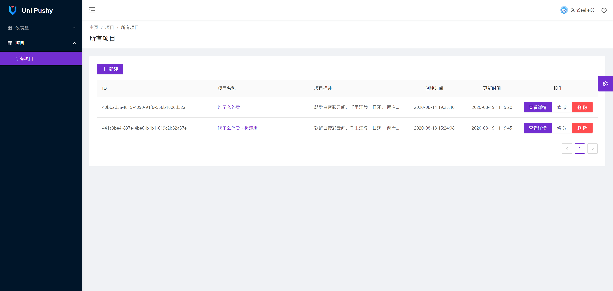
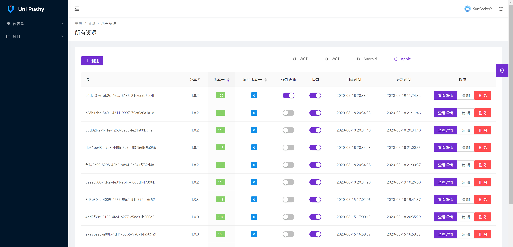

# upushy-admin

## 📌 简介

`upushy` uni-app 热更新管理平台。简称 `upushy`。

这是 `upushy` 的后台管理界面仓库。Github：[upushy-admin](https://github.com/SunSeekerX/upushy-admin)

基于 [`antd-vue-pro`](https://pro.antdv.com/) 的 uni-app 热更新后台控制系统

**配套客户端 SDK**：**[uni-pushy-client](https://github.com/SunSeekerX/uni-app-starter/tree/main/packages/uni-pushy-client)**

**配套后端**：**[upushy-server](https://github.com/SunSeekerX/upushy-server)**

**预览地址**：**[https://upushy.yoouu.cn/](https://upushy.yoouu.cn/)**

> 自行注册账号使用即可体验，对后台配置不熟悉的可以先使用我部署的服务做为测试。
>
> 只需要简单的配置下客户端就行。

**预览接口文档**：[https://api-upushy.yoouu.cn/docs/](https://api-upushy.yoouu.cn/docs/)

> **uni-app App 整包升级检测：** https://ask.dcloud.net.cn/article/34972
>
> **uni-app App 资源热更新：** https://ask.dcloud.net.cn/article/35667

**预览图**






## 📌 快速上手

### 开发

**克隆**

```bash
git clone https://github.com/SunSeekerX/upushy-admin.git
```

**进入项目目录**

```bash
cd upushy-admin/
```

**安装依赖 ，项目根目录下执行**

国内网络安装过慢可以安装 `tbify`， 使用说明：[tbify](https://sunseekerx.yoouu.cn/front-end/npm/#📂-tbify)

```bash
npm i
```

**配置环境变量，根目录下执行**

```bash
cp .env.example .env.development
```

打开 `.env.development`，填写环境变量

```shell
# 运行模式（development | production） 示例：development
NODE_ENV=

# 是否为预览模式(预览模式可以切换主题和布局)，生产环境设置为 false 示例: true
VUE_APP_PREVIEW=

# 请求超时时间，单位：秒 默认：6s 示例：6000
VUE_APP_REQUEST_TIMEOUT=

# 请求地址前缀，不带“/”！示例：http://192.192.192.192:3000
VUE_APP_API_BASE_URL=

# Api 加密 Rsa 公钥，需要使用 base64 进行编码一遍
# 格式：pkcs#8
# 密钥位数: 1024
# 需要和 server 配对
# 示例：LS0tLS1CRUdJTiBQVUJMSUMgS0VZLS0tLS0KTUlHZk1BMEdDU3FHU0liM0RRRUJBUVVBQTRHTkFEQ0JpUUtCZ1FESllNSVBEYWs0aWs3UU1STWJlOXlzeTBHaQp6TEVGMDRBMkFycGZuZTVHcEYvUEwxd3JYNmFyYW10eVMwSFc5c01VajZYV2hickZXNWFnaWNYSlZpQk1TbnFRCmJqNnpFQlFJTkdRVXllZGlWdkhHMWdNVStobEpURW9ZeHVpTG9RbHgrUmFkc1BZbmo5aGJuV3pVT0RlN1MwcEsKY3JxRXRpVkRYb3FZZEV1VUx3SURBUUFCCi0tLS0tRU5EIFBVQkxJQyBLRVktLS0tLQo=
VUE_APP_API_SIGN_RSA_PUBLIC_KEY_BASE64=

# 前端 OSS 信息配置，环境变量未进行判断，上传失败请查看控制台是否有报错
# 是否使用前端配置oss信息 (true|false) default：false
VUE_APP_WEB_OSS=
# OSS 地域，示例：oss-cn-hangzhou
VUE_APP_ALIYUN_OSS_REGION=
# OSS 存储桶名 示例：uni-pushy
VUE_APP_ALIYUN_OSS_BUCKET=
# 阿里云账号 ACCESS_KEY_ID
VUE_APP_ALIYUN_ACCESS_KEY_ID=
# 阿里云账号 KEY_SECRET
VUE_APP_ALIYUN_ACCESS_KEY_SECRET=
```

**启动**

```bash
npm run server
```

### 部署

**配置环境变量，根目录下执行**

```bash
cp .env.example .env.production
```

打开 `.env.production`，填写环境变量，环境变量描述同开发。

**打包**

```bash
npm run build
```

打包完成生成的静态文件位于 `dist` 目录下，为标准的 `web` 项目。直接放到服务器路径下即可。

> 需要配合 `jenkins` 集成 `ci&cd` 的可以参考 [Jenkins+vue 项目自动化构建部署](https://juejin.cn/post/6844904148291289095)

## 📌 uni-app 接入

请查看 **[uni-pushy-client](https://github.com/SunSeekerX/uni-app-starter/tree/main/packages/uni-pushy-client)** 说明。

## 📌 更新日志

[CHANGELOG](./CHANGELOG.md)

## 📌 FAQ

**这是什么？**

一个 uni－app 热更新的管理后台

**有什么用？**

可以用来管理 `uni-app` 热更新的资源和版本。

**什么是热更新？**

装在手机上的 app，不让用户知道就可以增加删除某些功能。快速修复 bug，快速更新功能。

**有哪些技术用到了热更新？**

`React native` ，`flutter`，`uni-app`

**为什么要做这个？**

网上又没有，不只能自己做。

**后端用的是什么语言框架？**

[NestJs](https://nestjs.com/)

**为什么用 NestJS ？**

哲学。

**为什么要用 antd-vue？**

`element-ui` 有一段时间不维护了，搞得人心惶惶，现在又有了，不知道啥意思。

~~至少它一直在更新，你来维护 `element-ui` 吗？~~

**为什么有个数据字典模块？**

想做一套完整的后台解决方案。

**TS 怎么样？**

有一次写 `vue` 尝试了下 `ts`，感觉像 "si" 一样。写 `ts` 还要多些那么多代码，为什么还要确定数据类型，有什么 `interface` ，`type`。

无意中看到了 `NestJS`，写多了 `ts` 感觉 `js` 像 "si" 一样。

**NestJS 好用吗？**

`Node` 后端要是火起来，`NestJS` 应该是碾压 `express`，`koa2`，`egg.js`。。。

**为什么要用你写的？**

你不想看看我是怎么实现的吗？

**会持续更新吗？**

不会

**确实学到了一些东西怎么感谢你？**

啊这~，你给我点一个 ⭐ 嘛～

**有问题可以问你吗？**

你要是知道你的问题是什么，可以来问我。

**怎么联系你。**

能找到这个项目找不到我的联系方式？
